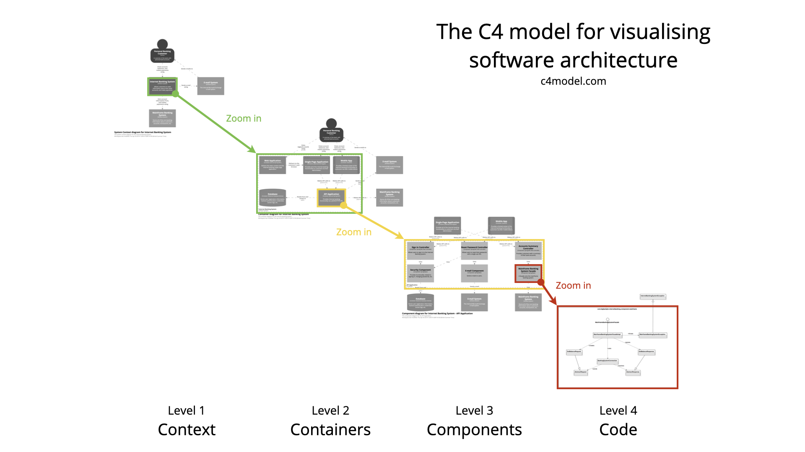
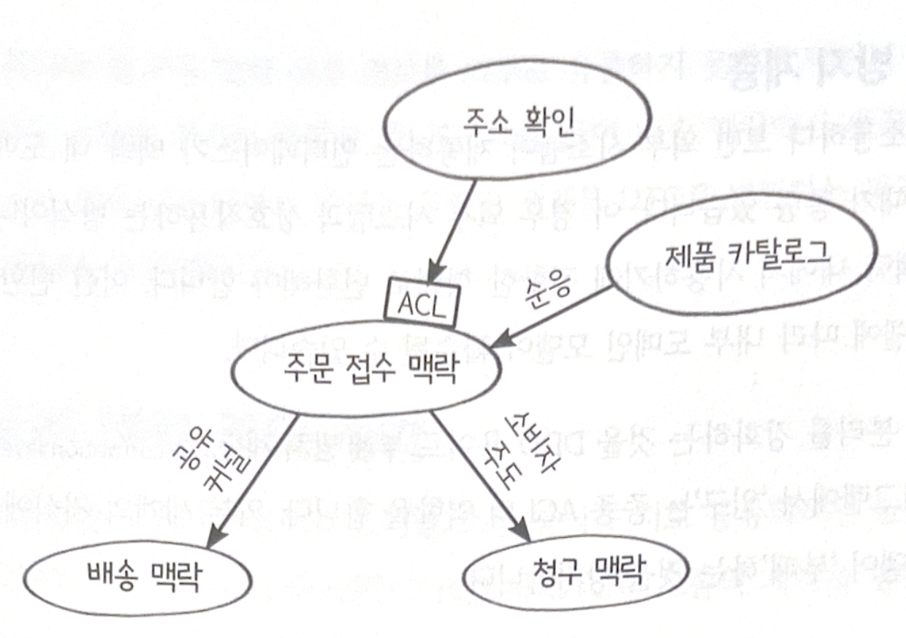
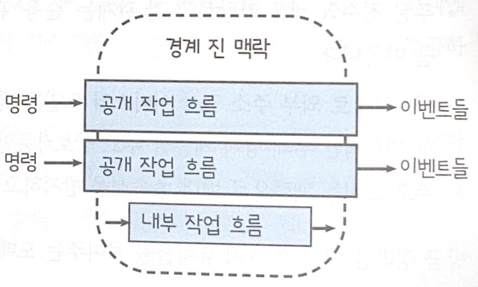
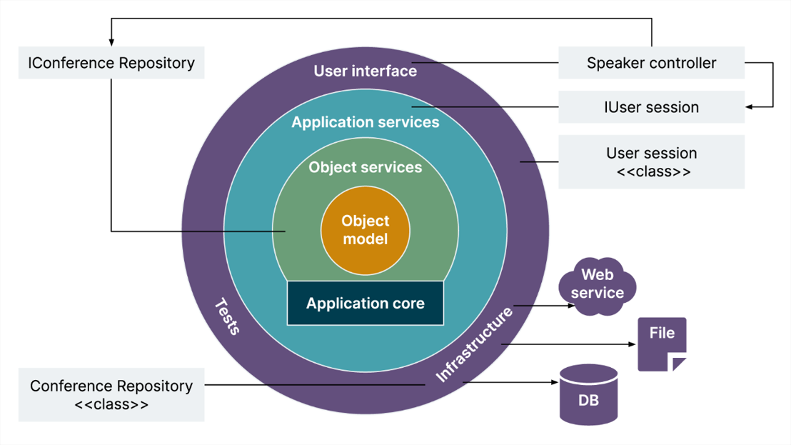

# Chapter 3 - 함수형 아키텍처 & 마무리

1. 함수형 도메인 모델링을 위한 소프트웨어 아키텍처를 알아보자
2. **경계 진 맥락**이나 **도메인 이벤트** 같은 DDD 개념들이 소프트웨어로 변환되는 방법을 살펴보자

## 용어 정리

- 이번 챕터에서 사용할 용어에 대해 먼저 정리하고 넘어가자.
- 소프트웨어 아키텍처 또한 그 자체로 또 하나의 **도메인**이므로, **공용어**로 이야기하는 것을 권고한다.

### 사이먼 브라운의 C4 접근법

- 소프트웨어 아키텍처를 시각화하고 문서화하기 위한 체계적인 프레임워크
- 기술적인 이해도가 다른 다양한 이해관계자(개발자, 관리자 등)와 효율적으로 소통하기 위해 고안된 접근법

#### C4 접근법에서의 소프트웨어 계층 구성

- 다음 4개의 계층으로 이루어짐. - 시스템 맥락: 최상위 계층으로, 전체 시스템을 나타냄. - 컨테이너: 웹사이트, 웹서비스, 데이터베이스 등 "배포 단위" - 컴포넌트: 코드를 구성하는 주요소 - 클래스(모듈): 저수준 메서드나 함수
  
- 출처: [https://korean-fe-article.github.io/c4model-kr/](https://korean-fe-article.github.io/c4model-kr/)

## 경계 진 맥락

> 모든 것을 하나로 묶으려 하지 말고, 의미가 통하는 단위로 선을 그어 관리하는 전략

- 예시) **'상품'** 이라는 단어
  - 영업팀: 가격, 할인율, 프로모션 대상인 **물건**
  - 물류팀: 무게, 부피, 창고 위치가 중요한 **배송 대상**
  - 고객지원팀: AS 기간, 보증 조건이 중요한 **관리 대상**

만약 이 모든 부서의 요구사항을 하나의 거대한 **`Product`** 모델에 집어넣는다면, 코드는 비대해지고 수정할 때 마다 예상치 못한 부작용(Side Effect)이 발생하게 된다.

**경계진 맥락**은 이 혼란을 해결하기 위해 **모델을 분리**한다.

- **독립된 언어(Ubiquitous Language)**: 각 맥락 안에서는 용어가 유일하고 명확한 의미를 가진다. '배송 맥락'에서의 상품은 오직 배송에 필요한 정보만 가진다.
- **책임의 분리**: 각 팀이나 모듈은 자신이 맡은 경계 안의 비즈니스 로직에만 집중한다.
- **팀 구조와의 연결**: 보통 하나의 경계진 맥락은 하나의 개발 팀이 담당하는 경우가 많아, 협업 효율을 높여준다.

## 경계 진 맥락 간의 소통

데이터를 주고 받을 때는 **API**나 **이벤트**를 통해 정해진 규칙대로만 소통한다. 책에서는 이벤트를 사용하는 것을 권장하는데, 맥락의 완전한 자율성을 보장하기 위해서는 이벤트 기반 아키텍처를 선택하는 것이 유리해서라고 한다.

맥락 간의 이벤트를 전송하는 방식은 아키텍처마다 다르지만, 주로 **Queue** 를 사용한다.

- 버퍼 비동기 통신에 적합
- 마이크로 서비스나 에이전트로 구현할 때 주로 첫 번째 선택지로 여겨짐
- 모놀리식 시스템에서도 맥락 간의 소통을 이벤트 기반으로 구현했다면 Queue 를 사용할 수도 있음

### 경계 진 맥락 간 데이터 전송

보통 맥락 간 통신에 쓰이는 이벤트는 단순 신호가 아니라 **이벤트 처리에 필요한 모든 데이터**를 포함한다. 만약 이벤트에 직접 넣기에는 데이터가 너무 크다면, 공유 데이터 저장소의 참조로 대신할 수도 있다. (AWS S3, Google Firestore..)

#### DTO(Data Transfer Object)

맥락 간 이벤트 전송에 사용하는 객체를 DTO 라고 정의한다. 실제 모델이 갖고 있는 데이터와는 다른 데이터를 갖고 있는, **전송 전용 객체**라고 이해하자. 맥락 간에는 DTO 객체의 직렬화/역직렬화를 통해 데이터를 주고 받는다.

### 신뢰 경계와 검증

경계 진 맥락의 테두리는 **신뢰 경계** 역할을 한다. 경계 진 맥락 내 모든 것은 신뢰할 수 있고 유효한 반면, 경계 진 맥락 밖은 그 무엇도 신뢰할 수 없으며 잘못됐을 수 있다. 따라서, 작업 흐름의 시작과 끝에 신뢰할 수 있는 도메인 내부와 신뢰할 수 없는 도메인 외부 세계를 중개하는 **출입구**를 추가한다.

**입구**

- 내부 도메인 모델의 제약을 준수하는지 검증.
  - NULL 체크, 문자열 길이 체크, 타입 체크 등등..
  - 입구에서 검증을 통과한 DTO 만을 유효한 모델(도메인 객체)로 변환하여 내부 세계로 전달한다.

**출구**

- 맥락 내부 정보를 외부로 유출하지 못하게 막는다.
  - 보안을 지키고, 맥락 간의 결합을 막는다.
  - 도메인 객체를 DTO로 변환하는 과정에서 의도적으로 정보를 누락시킨다.

## 경계 진 맥락 간의 계약

경계 진 맥락 간의 소통을 위해 소통 양식을 정의하는 모종의 계약을 만든다. 이 때 필연적으로 맥락 간의 결합이 생기기 마련이고, 우리는 항상 이 결합을 최대한 줄이고 싶어한다. 그래서 DDD 커뮤니티에서는 누가 계약을 주도하는지를 정의하는 다양하고 전형적인 관계를 일컫는 몇몇 용어를 개발했다.

- **공유 커널** 관계: 두 맥락이 도메인 디자인 일부를 공유하는 경우
- **고객/공급자** 또는 **소비자 주도 계약** 관계: 하류 맥락이 정의한 계약을 상류 맥락이 따르는 경우
- **순응** 관계: 소비자 주도의 반대

### 부패 방지 계층

외부 시스템과 소통하다 보면 인터페이스가 내부 맥락 내 도메인 모델과 전혀 일치하지 않는 경우가 있는데, 이 경우 내부 도메인 모델 훼손을 방지하기 위해 **부패 방지 계층** 을 입구에 추가해서 사용하기도 한다.

### 맥락 간의 관계를 나타내는 맥락 지도

맥락 간의 관계를 다이어그램 형태의 지도로 나타내는 문서화 방식의 일종

## 경계 진 맥락의 작업 흐름

우리는 앞서서 비즈니스 **작업 흐름**을 **명령을 받아서** 한 개 이상의 **도메인 이벤트를 생성**하는 작은 **프로세스** 단위로 간주했다. 함수형 아키텍처에서는 작업 흐름을 명령 객체를 입력 받아서 이벤트 객체들을 출력하는 **단일 함수**로 구현한다. 모든 작업 흐름은 반드시 단일 맥락으로 구현되어야 한다.

## 경계 진 맥락의 코드 구조

전통적인 계층 아키텍처에서 코드는 여러 계층으로 나뉜다. 핵심 도메인 또는 비즈니스 로직 계층, 데이터베이스 계층, 서비스 계층, API 또는 사용자 인터페이스 계층 등등. 계층 아키텍처에서의 작업 흐름은 항상 최상위 계층에서 시작하여 데이터베이스 계층으로 내려가고, 다시금 최상위 계층으로 되돌아간다.

이 방식은 문제가 많다. 특히 중요한 디자인 원칙인 **'같이 변경할 코드는 한데 모여 있어야 한다'** 를 위반한다. 같은 계층, 즉 '수평' 방향으로 같은 위치에 있는 여러 작업 흐름의 코드들을 같이 모아두기 때문에 특정 작업 흐름을 수정하려면 **모든 계층을 수정**해야 한다.

그래서, 도메인 코드를 중심에 두고 그 외 측면들이 도메인을 에워싸게 배치해서 각 계층은 **자신보다 안쪽 계층에만 의존하고 외부 방향으로는 의존하지 않는다**는 규칙을 따르는 **양파 아키텍처**가 함수형 아키텍처를 권장한다. 작업 흐름을 한 방향으로만 향하게 해서 개발할 수 있게 된다. (헥사고날 아키텍처나 클린 아키텍처 접근법도 있다.)
